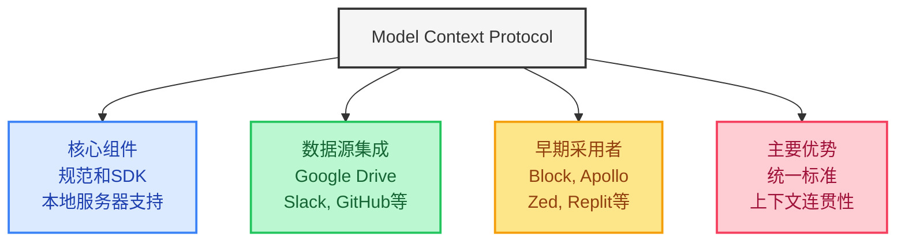

# MCP 架构概览

```mermaid
graph TD
    MCP[Model Context Protocol] --> Core[核心组件<br/>规范和SDK<br/>本地服务器支持]
    MCP --> Integration[数据源集成<br/>Google Drive<br/>Slack, GitHub等]
    MCP --> Users[早期采用者<br/>Block, Apollo<br/>Zed, Replit等]
    MCP --> Benefits[主要优势<br/>统一标准<br/>上下文连贯性]

    classDef default fill:#f5f5f5,stroke:#333,stroke-width:2px
    classDef core fill:#dbeafe,stroke:#3b82f6,color:#1e40af
    classDef integration fill:#bbf7d0,stroke:#22c55e,color:#166534
    classDef users fill:#fde68a,stroke:#f59e0b,color:#92400e
    classDef benefits fill:#fecdd3,stroke:#f43f5e,color:#9f1239

    class MCP default
    class Core core
    class Integration integration
    class Users users
    class Benefits benefits
```
