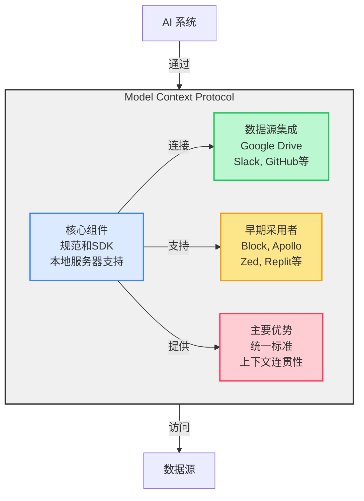

# MCP 架构概览

## 架构图

## 工具列表

| 类别 | 工具名称 | 功能说明 | 使用场景 |
|------|----------|----------|----------|
| **文件系统** | read_file | 读取单个文件的完整内容 | 查看文件内容，支持多种编码格式 |
| | write_file | 创建或覆盖文件 | 保存数据或更新文件内容 |
| | list_directory | 列出指定路径下的文件和目录 | 查看目录结构 |
| | search_files | 递归搜索匹配文件 | 模糊查找文件 |
| | move_file | 移动或重命名文件和目录 | 文件重组织、重命名 |
| **GitHub** | create_repository | 创建新仓库 | 开始新项目 |
| | fork_repository | 复制他人仓库 | 基于现有项目开发 |
| | create_pull_request | 创建PR | 提交代码合并请求 |
| | push_files | 批量推送文件 | 多文件代码提交 |
| **数据库** | read-query | 执行SELECT查询 | 数据查询 |
| | write-query | 执行INSERT/UPDATE/DELETE | 数据修改 |
| | create-table | 创建数据表 | 建立数据结构 |
| **知识图谱** | create_entities | 创建多个实体 | 建立知识节点 |
| | create_relations | 创建实体关系 | 建立知识连接 |
| | read_graph | 读取整个图谱 | 查看知识网络 |
| **网页自动化** | puppeteer_navigate | 导航到URL | 访问网页 |
| | puppeteer_click | 点击页面元素 | 模拟用户点击 |
| | puppeteer_fill | 填写输入字段 | 自动填表 |
| **实用工具** | add | 加法运算 | 数值计算 |
| | echo | 返回输入内容 | 测试和调试 |
| | fetch | 获取URL内容转Markdown | 网络内容抓取 |